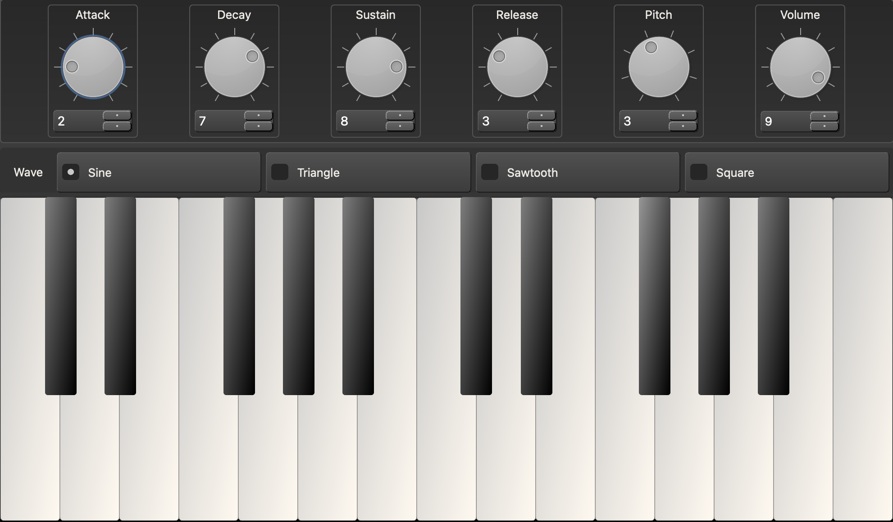

# SnakeSynth
A basic synthesizer application created using Python, using SciPy for wave generation, NumPy for wave manipulation and PySide for GUI.
___

### Project Contributors
1. Nora Luna
2. Rohan Singh
3. Jay Best
4. Tien Duc Pham
___

### Overview
The main objectives of this project are:
- To design and implement a synthesizer using Python.
- To develop an interface for the synthesizer that allows users to interact with it and create sounds.
- To incorporate various waveforms and filters to create a diverse range of sounds.
- To enable the synthesizer to be used as a live performance tool or as a studio production tool

**MVP:** An application that has keys to generate different tones, with volume control.
___
### Prerequisites to set up SnakeSynth

- Python3
- PySide6
- SciPy
- NumPy
- Qt Creator 4.15.0
- VS Code
- VS Code Plugins:
	- Python
	- Pylance
	- Qt for Python
___

### How to Build and Run SnakeSynth

1. Download the files in this repository.
2. Ensure you have Python and pip downloaded on your local machine.
	https://www.python.org/
3. Download the requirements. 
	`pip3 install -r requirements.txt`
4. Run the synth with the command inside of the src folder:
	`python3 main.py`
_____

### Testing

Pytest was utilized to create a comprehensive suite of test cases. These test cases covered various aspects of the synthesizer's functionality, including waveform generation, envelope shaping, and volume classes. To validate the correctness of the waveform generation, test cases were designed to compare the generated waveforms against expected waveforms for different oscillator types and parameters. Additionally, the project utilized matplotlib for visual testing of the synthesizer's output. Test cases were written to plot and compare the generated waveforms, spectrograms, and frequency spectra against reference plots. This allowed for precise analysis of the audio output, ensuring that the synthesizer produced the intended sounds accurately. The combination of pytest and matplotlib provided a robust testing framework for the synthesizer project, allowing for thorough evaluation of its functionality and performance. 
_____

### License

[LICENSE](LICENSE)
_____
### SnakeSynth UI

_____

### Project Summary

In terms of what worked, our decision to build the synth using an object-oriented approach proved to be highly effective. This approach allowed us to neatly organize the different functionalities of the synthesizer into separate classes, which facilitated modularity and code reusability. We implemented an oscillator class that handled waveform generation, a volume class that controlled gain, and an ADSR envelope class that applied the envelope to the waveforms. These classes seamlessly interacted with each other, resulting in a cohesive and flexible synth structure.

However, we encountered a significant challenge when implementing the ADSR envelope functionality. Initially, we had the synth looping the waveforms when a key was pressed, which worked well until we integrated the envelope. We discovered a bug where the looping wave also caused the envelope to loop, leading to unexpected sounds. To overcome this issue, we had to introduce a threading function that continuously added new samples while a key was pressed. This resulted in undertaking a major refactor of the ADSR envelope class to capture its state at each stage of the envelope and apply it for the duration of a key press. While this refactor resulted in substantial changes to our code, it ultimately produced the desired envelope behavior.

Regarding the implementation of MIDI, we have encountered various approaches, but only one has proven to be reliable: the utilization of the pygame module. Unfortunately, due to time constraints, we were unable to extensively explore alternative methods and assess their compatibility with our project. Consequently, we focused our code around the detection method that demonstrated effective performance with pygame. It is worth noting that our MIDI hardware detection was specifically validated on a Windows operating system, utilizing the Nektar Impact GX49 MIDI controller.

Moving forward, there are several areas we would like to improve in this project. Firstly, we recognize that we have only scratched the surface of the various synth functionalities that can be implemented. As we have limited time during the duration of this class, we were unable to explore all the possibilities. Therefore, in the future, we would like to expand the synth's capabilities by incorporating additional features such as filters, modulation sources, and effects. Additionally, we aim to enhance the user interface and provide more intuitive controls, allowing for greater experimentation and customization. Ultimately, we believe there is ample room for growth and improvement in this project, and we are excited to continue exploring and refining our synth in the future.
_____

### CRR Additions

For Code Reading and Review, we will be improving this repository.
Additional documents can be found here:
https://docs.google.com/document/d/1WDT4E7j-O9IBMl9S6XtEHOUvt_dyF3wP5eEJXg2nwgc/edit?usp=sharing
